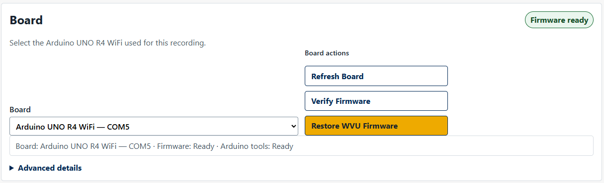
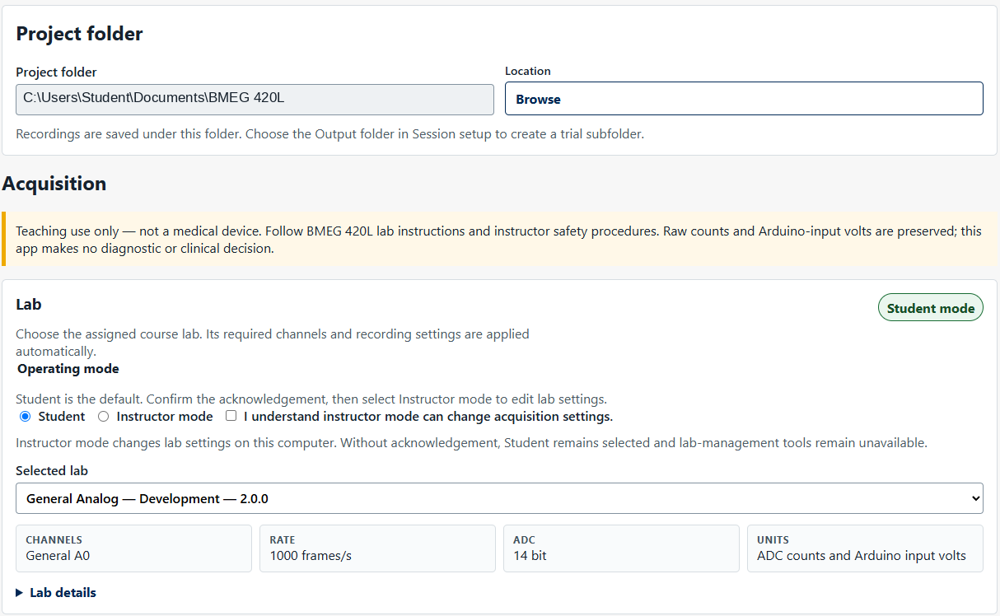
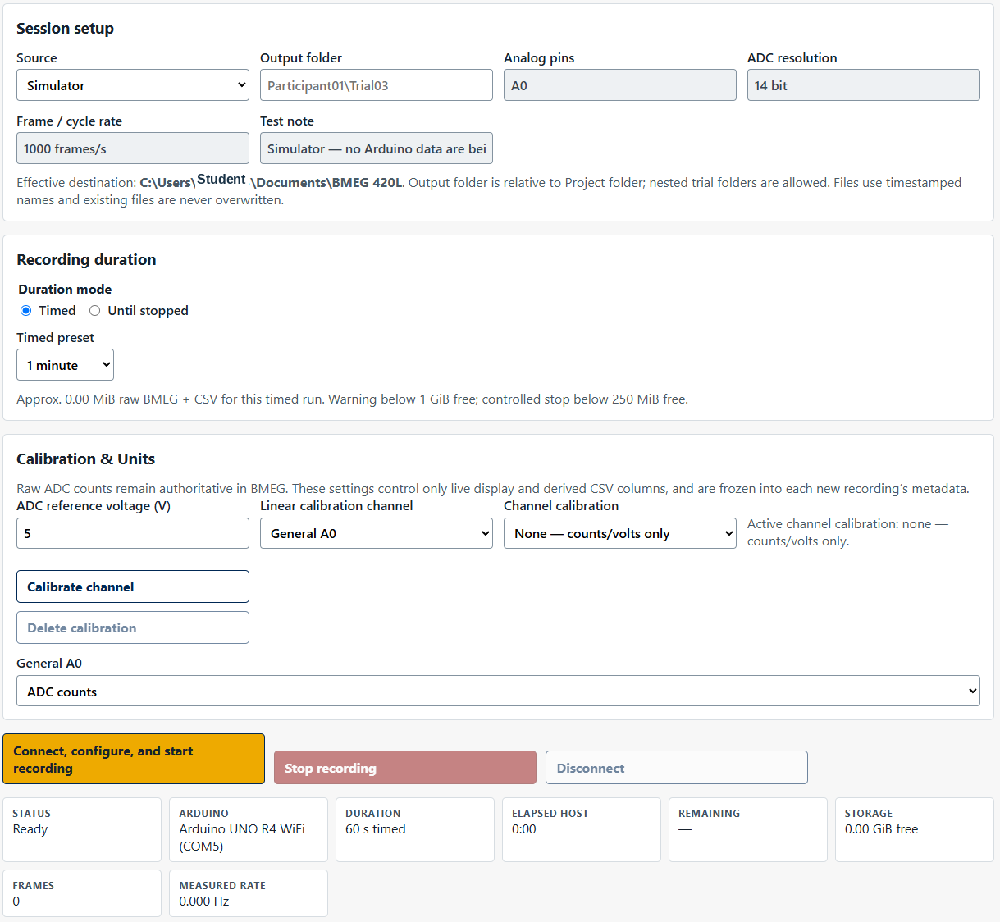
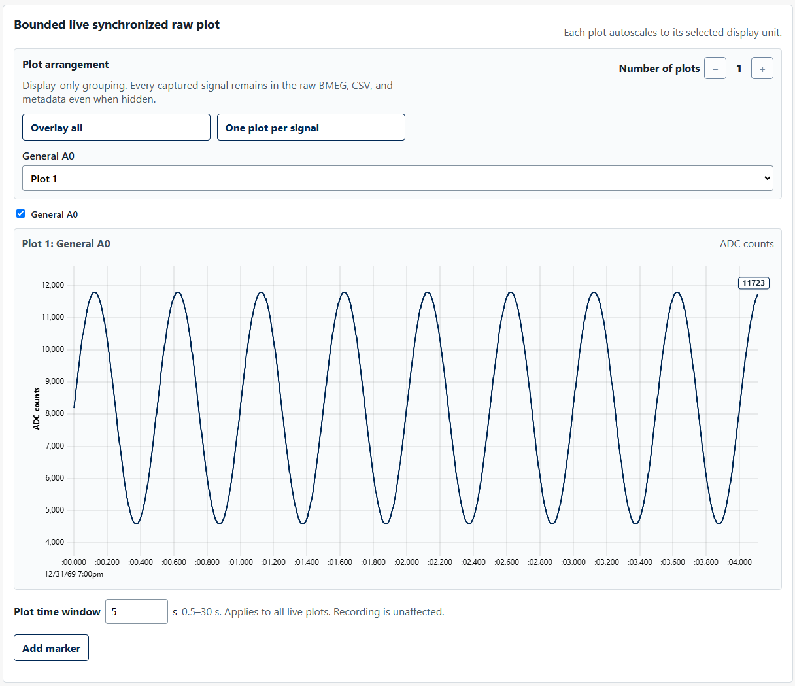

# WVU Bioinstrumentation Studio

WVU Bioinstrumentation Studio is a Windows desktop application for BMEG 420L. It acquires, visualizes, calibrates, and saves synchronized biomedical-instrumentation signals from an Arduino UNO R4 WiFi and course hardware.

Teaching use only — not a medical device. Follow BMEG 420L lab instructions and instructor safety procedures. Do not use this software for diagnosis or clinical decisions.

## Capabilities

- Automatic Arduino UNO R4 WiFi discovery, WVU firmware verification, and controlled firmware restoration.
- ECG capture; EMG + pressure capture; blood pressure + PPG capture; and raw four-state pulse-ox capture.
- Synchronized acquisition of one to six analog channels with configurable plot grouping and per-trace visibility.
- Color-coded legends for plots containing multiple visible signals, a synchronized 0.5–30 s live display window, and persistent newest-value labels in the selected display units.
- Display-only decimation for longer live windows while recorded BMEG and CSV data remain full-rate.
- Counts, volts, MPXV pressure conversion, and student-created local linear calibration for supported channels.
- Project-folder and trial-folder organization with automatic raw BMEG, CSV, metadata, and event-sidecar output.
- Instructor-managed, versioned course-lab definitions with factory defaults, import/export, and safe pin/rate/output configuration.

The distributed application bundles the Arduino command-line runtime and UNO R4 core. Students do not need Arduino IDE or Arduino CLI for normal use.

## Interface overview

### Board and firmware

Select the Arduino UNO R4 WiFi, verify the WVU firmware, or restore it with the bundled offline Arduino runtime when required.

### Project and lab selection

Choose the Project folder and assigned course lab. Lab definitions apply the required channels, sampling settings, ADC resolution, plot defaults, and supported display or calibration options.

### Session setup and calibration

Choose the data source and relative Output folder, set the recording duration, and select supported engineering-unit or calibration options. The effective recording path remains inside the selected Project folder.

### Live visualization

Live plots are display-only: changing plot groups, trace visibility, engineering units, or the synchronized time window does not change the raw acquisition. Multi-signal plots show a color-coded legend, and each visible trace displays its newest rounded value. The Plot time window applies to all live plots.

#### Display behavior

- Plot groups and trace visibility affect only the live display.
- The synchronized time window can be adjusted from 0.5 to 30 seconds.
- Longer windows may use display-only decimation to keep the interface responsive.
- The newest value for each visible trace is shown in the selected display unit.
- Multi-signal plots include a color-coded legend.
- Raw recordings remain full-rate and are not changed by display settings.

## Requirements

- Windows x64, primarily Windows 11.
- Arduino UNO R4 WiFi.
- The relevant BMEG 420L course hardware and instructor-approved setup.
- Administrator approval to install the primary system-wide installer; the application runs normally without elevation after installation.

## Getting started

1. [Install the application](docs/INSTALLATION.md).
2. Connect the Arduino UNO R4 WiFi and open the application.
3. Confirm the Board and Firmware status at the top of the window.
4. Select a Project folder, choose the assigned course lab, and set an Output folder for the trial.
5. Record and retrieve the generated files from the selected Project/Output folder.

During a recording, you may rearrange plots, hide or show traces, change supported display units, adjust the shared live time window, read newest-value labels, and add markers without affecting the underlying full-rate recording.

See the concise [Student Quick Start](docs/STUDENT_QUICK_START.md) and the [Troubleshooting guide](docs/TROUBLESHOOTING.md).

## Course labs

| Lab | Default inputs | Default rate | Default ADC |
| --- | --- | ---: | ---: |
| ECG — Course Capture | A0 ECG | 1000 frames/s | 14 bit |
| EMG + Force — Course Capture | A0 raw EMG, A1 rectified EMG, A2 envelope, A3 pressure surrogate | 1000 frames/s | 14 bit |
| Blood Pressure + PPG — Course Capture | A0 PPG, A1 MPXV, A2 XGZP; D4 green LED | 200 frames/s | 14 bit |
| Pulse Oximetry — TX + RX Raw Capture | A0 TX, A1 RX; D5 red, D6 IR | about 250 cycles/s | 14 bit |
| General Analog — Development | 1–6 inputs selected from A0–A5 | 1000 frames/s | 14 bit |

More detail is in [Lab Configuration](docs/LAB_CONFIGURATION.md). Instructors should use the [Instructor Guide](docs/INSTRUCTOR_GUIDE.md).

## Data files

Raw `.bmeg` data are authoritative. Each recording also produces metadata and a profile-aware CSV in the effective session folder. Raw counts are always retained; voltage and engineering-unit columns are derived from the recording-time settings.

Live plot windowing, trace visibility, legends, endpoint labels, and display decimation do not alter the recorded raw samples.

Pulse oximetry preserves raw TX/RX measurements for RED, DARK 1, IR, and DARK 2. The application does not subtract ambient states, calculate SpO2, calculate heart rate, or perform physiological interpretation.

## Building from source

Development requirements, commands, the bundled Arduino runtime, and the production-build distinction are documented in the [Developer Guide](docs/DEVELOPER_GUIDE.md). Use the Tauri production build pipeline; a plain Cargo release build is not a distributable application because it does not package the frontend assets.

## Documentation

- [Installation](docs/INSTALLATION.md)
- [Student Quick Start](docs/STUDENT_QUICK_START.md)
- [Instructor Guide](docs/INSTRUCTOR_GUIDE.md)
- [Calibration and Units](docs/CALIBRATION_AND_UNITS.md)
- [Hardware](docs/HARDWARE.md)
- [Troubleshooting](docs/TROUBLESHOOTING.md)
- [Architecture](docs/ARCHITECTURE.md)
- [USB Protocol](docs/USB_PROTOCOL.md)
- [Release Checklist](docs/RELEASE_CHECKLIST.md)

## License

WVU Bioinstrumentation Studio is licensed under the Apache License 2.0. See [LICENSE](LICENSE).

Third-party components bundled with or used by the project remain subject to their respective licenses. See [Third-Party Notices](docs/THIRD_PARTY_NOTICES.md).

## Acknowledgments

WVU Bioinstrumentation Studio was developed for biomedical instrumentation teaching and laboratory use at West Virginia University.

### AI-assisted development

Development of WVU Bioinstrumentation Studio used OpenAI's ChatGPT and Codex as AI-assisted software-development tools for tasks including design exploration, code generation and refactoring, debugging, test planning, code review, and documentation. AI-generated suggestions were reviewed, modified where necessary, tested, and accepted by the project maintainer before integration.

OpenAI is not a sponsor of, and does not endorse, this project.
