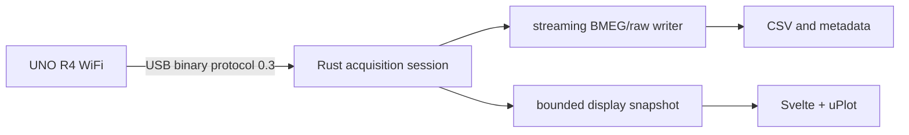

# Architecture

WVU Bioinstrumentation Studio is a Tauri desktop application with a Svelte/TypeScript frontend and Rust backend. The Arduino UNO R4 WiFi runs the repository-controlled reference firmware.

- The firmware provides synchronized logical frames. Analog channels are read sequentially within a frame, not electrically simultaneously.
- The Rust session owns serial I/O, packet validation, CRC/sequence accounting, full-rate storage, and safe finalization.
- The frontend polls bounded display snapshots at a limited rate; it does not receive one UI event per sample.
- Lab definitions describe course acquisition, display defaults, supported conversion types, and required firmware capabilities. Factory definitions are immutable; local instructor revisions are explicit catalog records.
- The Arduino runtime is bundled for distribution but copied/prepared in per-user writable application data. Production CLI processes are launched by Rust with hidden Windows console creation.
